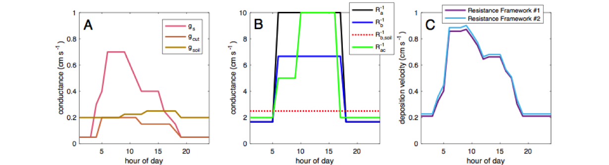
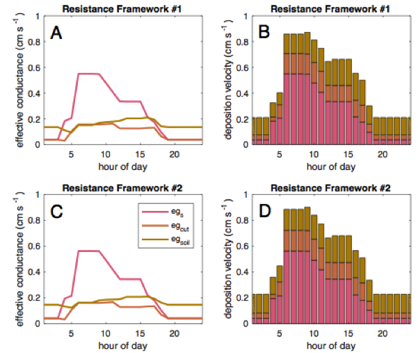

# Overarching Document AQMEII4 (Activity 1)


## Input data for the simulations

Input data necessary to run the simulation have been prepared and are accessible to all participants. 

### Emission Inventory

_NA anthropogenic emissions:_

2010 and 2016 gridded files in CMAQ-ready format for the CB6 and SAPRC mechanisms have been prepared and are available at:

```
https://drive.google.com/drive/folders/1uyMXMs5yDAHNmq58YqJfApkMkrZVZCKW
```

_EU anthropogenic emissions_ 

Data for 2009 and 2010 are available at:

```
Host               : web-ftp81.tno.nl
Protocol           : FTP
Encryption         : Require explicit FTP over TLS
Logon type         : normal
User               : macc_iii@ftp0015.web-ftp81
Password           : AH2qzFtK64Uw
```

_EU forest fires emissions_

Data for 2009 and 2010 were kindly produced by FMI and are available at:

```
LINK
```

_Global data on NOx produced by lightning_

Data were assembled for AQMEII by the US-EPA starting from those gathered by GEIA and GEIA_ECCAD are available at:

```
https://drive.google.com/drive/folders/1R83HYZgn6qd0L01UN_u5nHeQ5swbMCYj
```

_Biogenic emissions_

Data are not available and should be accounted for by each modelling group according to the model set up:


### Boundary conditions 

_ECMWF reanalysis data for 2009/2010 (EU) and 2010/2016 (NA)_

Data, kindly provided by ECMWF, are available at:

```
ftp server      : dissemination.ecmwf.int
username        : htap
password        : dh45ya09
Data directory  : DATA/MACC_HTAP/eac4

or at:

https://drive.google.com/drive/folders/1rOLHivePbNqC4dIGG4ldQu5jFMyJj4Hq
```


## Output data expected

This activity of AQMEII4 relates to the regional scale simulations. Therefore output data will be expected in three different flavours:

1. _at all grid points of the computational domain projected on the common grid_
2. _at monitoring sites at surface_
3. _at monitoring sites as profiles_


_The space domains of the two common grids and the two years to be modelled are respectively for NA and EU:_

NA:
```
130°W <-> 59.5°W, 23.5°N <-> 58.5°N,

2010 and 2016
```
EU:
```
30 W <-> 60°E, 25°N <-> 70°N

2009 and 2010 
```
_Spatial resolution:_ 

```
For both domains the spatial resolution of the common grids is 0.125° x 0.125° 
```

AQMEII4 simulations are identified by a "sequence-case" code SSSS-CCC, where SSSS is a four-digit number for the sequence and CCC is a three-digit number for the case.

_AQMEII4 sequences (SSSS) are:_

```
- 0241: North America (02), year 2010 (4), Grid (1)
- 0246: North America (02), year 2010 (4), Receptors (6)

- 0251: North America (02), year 2016 (5), Grid (1)
- 0256: North America (02), year 2016 (5), Receptors (6)

- 0341: Europe (03), year 2009 (4), Grid (1)
- 0346: Europe(03), year 2009 (4), Receptors (6)

- 0351: Europe (03), year 2010 (5), Grid (1)
- 0356: Europe(03), year 2010 (5), Receptors (6)
```

### 1. Output at all gridpoints 
The variables requested at every grid point of the coommon grid as described in the classifications above mentioned are presented in:

- [NA2010](../domains/NA2010/0241/)
- [NA2016](../domains/NA2016/0251/)
- [EU2009](../domains/EU2009/0341/)
- [EU2010](../domains/EU2010/0351/)

### 2. Output at receptors
The variables requested at every receptor as described in the classifications above mentioned are presented in:

- [NA2010](../domains/NA2010/0246/), 
- [NA2016](../domains/NA2016/0256/), 
- [EU2009](../domains/EU2009/0346/), 
- [EU2010](../domains/EU2010/0356/)

For every set of variables presented, the corresponding Technical Specification Document (TSD) see next sectiion, and metafile for the encoding precedure is included in the corresponding directory.


## Submitting model output to ENSEMBLE: Technical Specification Documents, Metafiles, and ENFORM

Information relating to submission of model results for the runs to be performed for the XX2010 (where XX will be NA and EU for the North American and European case respectively) case study is contained in the archive file named “TSD-metafile-enform-XX2010-2D.zip” that will be delivered to you following your request of a user ID and password to access to input data.

This archive includes:

- documents called Technical Specification Documents (TSDs);
- ASCII files called Metafiles (extension src);
- one archive containing Fortran programs.

The TSDs provide detailed instructions on the preparation and transmittal of model-predicted. Every other data type (gridded, point evaluation, vertical profile, volume, satellite, etc) will have a dedicated TSD which will also be different if it applies to EU or NA case. Much of the information contained in the TSDs is repeated but every TSD contains all information necessary to prepare the model output.

The suite of ENFORM programs to convert model output into ENSEMBLE data file is standard and applies to all data types. One program named enform_aq.f will manage the transformation of format for 2D model output and a companion program, enform_aqr.f, will manage model output for receptors and vertical profiles. These programs will need some meta data information that will be delivered with the zip file.
 
The model output submission procedure has been devised to be simple and standardized.  It is based on experience gathered over the last 10 years of using the ENSEMBLE system for emergency response applications of air quality mesoscale models.  Several communities of AQ modellers have used it to date with no major problems.  

As you will realize we have opted for separating the outputs into the smallest possible information set (one variable per file) as we want you to transfer your model results via FTP rather than by shipping hard disks to the JRC.  Once the files reach us they will be uploaded to the ENSEMBLE system and you will then be able to access them remotely through the web interface.  This will allow you to check on the correct upload of your results and then to compare your model results with other model results and with monitoring data and to perform ensemble analyses.

### Land Use Types
Model results on deposition will have to be referred to specific land use types. The common list of types is presented in the following table. An excel spread sheet was put together were all model native LU types were associated or associateable to the types listed in the table. 

When reporting the results per land type the numbering in the table should be considered as reference:

|Type Number|Generic LU Categories for Remapping|
|:---:|:---:|
|01|Water|
|02|Developed-Urban|
|03|Barren|
|04|Evergreen needleleaf forest|
|05|Deciduous needeleaf forest|
|06|Evergreen broadleaf forest|
|07|Deciduous broadleaf forest|
|08|Mixed forest|
|09|Shrubland|
|10|Herbaceous|
|11|Planted/Cultivated|
|12|Grassland|
|13|Savanna|
|14|Wetlands|
|15|Tundra|
|16|Snow and Ice|


## Appendix
This appendix provides evidence of the importance of acquiring the components of two deposition schemes, in order to understand the  different roles that different path ways can have in determining yet comparamble values of total deposition.

### Incredibly useful diagnostics for dry deposition.
### by Olivia Clifton (oclifton@ldeo.columbia.edu)

When there is more than one pathway for dry deposition (e.g., soil, stomata, and leaf cuticles for ozone), it is challenging to pinpoint the drivers of trends and inter-model differences in dry deposition without knowledge of individual depositional processes. There are several key variables that need to be archived from models in order to quantify which processes matter most for dry deposition.

Below, we detail the calculation of the “effective conductance” based on two commonly-used resistance frameworks for dry deposition, assuming that dry deposition occurs to plant stomata, leaf cuticles, and soil. The effective conductance for a given depositional pathway is the amount of deposition (in velocity units) that actually occurred through that pathway (i.e., the the effective stomatal conductance divided by the deposition velocity is the fraction of dry deposition that occurs through stomatal uptake).

### Resistance Framework #1
For gases, deposition velocity (vd) is typically regarded as the inverse of a series of resistances. 

v_d=(R_a+R_b+R_c )^(-1)

Ra is the resistance to above-canopy turbulence, and is typically given as:

R_a=1/(ku^* )[ln((z_r-d)/z_(0,m) )-Ψ_H ((z_r-d)/L)]

k is the von Kármán constant; u* is friction velocity; zr is reference height; d is zero-plane displacement height; z0,m is roughness length for momentum; ѰH is the stability correction function; and L is the Monin-Obukhov length.

Rb is the resistance to molecular diffusion in the small boundary layer between the atmosphere and the surface, and is typically given as:
R_b=2/(ku^* )(κ/D_x  )^(2⁄3)
κ is thermal diffusivity of air and Dx is diffusivity of a gas x. 

Rc is the resistance to deposition posed by the stomatal and non-stomatal surfaces. Stomatal and non-stomatal resistances to deposition are added in parallel, but if the surfaces of deposition are at substantially different heights then in-canopy turbulence should be considered. One way of doing this simply is the following:

R_c=g_c^(-1)=1/(R_(c,leaf)^(-1)+(R_ac+R_soil )^(-1) )

R_(c,leaf)=1/(R_s^(-1)+R_cut^(-1) )

This assumes deposition to leaves is at the top of the canopy, thus only the soil deposition is impacted by in-canopy turbulence. We call this Resistance Framework #1 (it is the Wesely [1989]) framework). Rc,leaf is the canopy resistance to leaf deposition, Rac is the in-canopy aerodynamic resistance and Rsoil is the resistance to soil deposition. Rcut is the resistance to cuticular deposition, and Rs is the resistance to stomatal deposition. The inverse of a resistance is a conductance, denoted by “g”. 

The effective conductance (denoted by “eg”) for stomatal deposition is:

 eg_s=g_s/g_c  v_d 

The effective conductance for cuticular deposition is:

 eg_cut=g_cut/g_c  v_d 

The effective conductance for soil deposition is:

 eg_soil=((R_soil+R_ac )^(-1))/g_c  v_d 

### Resistance Framework #2
Another commonly used resistance framework for dry deposition more accurately considers deposition to different surfaces by distinguishing between Rb to the soil vs. leaves (e.g., Massman [2004]). We call this Resistance Framework #2.

v_d=(R_a+1/(1/(R_(b,leaf)+R_(c,leaf) )+1/(R_ac+R_(b,soil)+R_soil )) )^(-1)

For this resistance framework, the calculation of the effective conductance is slightly different. In the below equation for egs, vd is scaled by the stomatal fraction of leaf deposition (i.e., stomatal and cuticular deposition) and the leaf fraction of the total deposition.

eg_s=g_s/(g_s+g_cut )  (1/(R_(b,leaf)+R_(c,leaf) ))/(1/(R_(b,leaf)+R_(c,leaf) )+1/(R_ac+R_(b,soil)+R_soil )) v_d 

The calculation of egcut is similar to egs (i.e., replace the first term, the stomatal fraction of leaf deposition, with the cuticular fraction of leaf deposition).

eg_cut=g_cut/(g_s+g_cut )  (1/(R_(b,leaf)+R_(c,leaf) ))/(1/(R_(b,leaf)+R_(c,leaf) )+1/(R_ac+R_(b,soil)+R_soil )) v_d

The calculation of egsoil only includes the soil fraction of the total deposition and vd.

eg_soil=(1/(R_ac+R_(b,soil)+R_soil ))/(1/(R_(b,leaf)+R_(c,leaf) )+1/(R_ac+R_(b,soil)+R_soil )) v_d

We plug made-up conductances (i.e., gcut, gs, gsoil, Rb-1 (Rb,leaf-1 for Resistance Framework #2), Rb,soil-1 (only for Resistance Framework #2), Ra-1, and Rac-1 into Resistance Frameworks #1 and #2). The conductances used are shown in Figure 1a and 1b. Figure 1c shows that the deposition velocities estimated using these conductances and the different frameworks. Figures 2a and 2c show the effective conductances for stomatal, cuticular, and soil deposition for the respective frameworks. Evident from the comparison of Figure 1a and Figures 2a and 2c, the effective conductances do not have the same magnitude or variability as the conductances. The contribution of each depositional pathway to the deposition velocity, calculated with the effective conductances, in shown in Figures 2b and 2d, illustrating how they can be used to examine the contribution of the deposition pathways to the deposition velocity.
Figure 1. Made-up hourly conductances for stomatal (S), cuticular (CUT) and soil deposition pathways in A), and for transport processes in b). deposition velocities calculated with quantities in a) and B) and the two resistance frameworks. 



Figure 1. Made-up hourly conductances for stomatla (S), cuticular (CUT) and soil deposition pathways in A) and for transport processes in B). Deposition velocities Calculated with quantities in A) and B) and the two resistance frameworks




Figure 2. Hourly Individual Effective conductances for stomatal (S), CUTICUlar (CUT) and soil deposition pathways in A) and c) for each resistance framework. The sum of the effective conductances (i.e., the deposition velocity) in b) and D) for each resistance framework. 


#### Takeaway points.
```
1. Calculation of effective conductances will depend on resistance framework used
2. Calculation of effective conductances can be done using archived fields, but all the components of the resistance framework need to be archived
3. Examining both the conductances and effective conductances is helpful to answer the following science questions:
4. Which processes drive spatiotemporal variability and trends and inter-model differences in dry deposition?
5. How much do changes in a given process matter for changes in dry deposition?
```
For detailed formulation downlowd the original document: 

### References.
Massman, W. J. (2004). Toward an ozone standard to protect vegetation based on effective dose: a review of deposition resistances and a possible metric. Atmospheric Environment, 38, 2323-2337.

Wesely, M. L. (1989). Parameterization of surface resistances to gaseous dry deposition in regional-scale numerical models. Atmospheric Environment, 23(6), 1293-1304.

